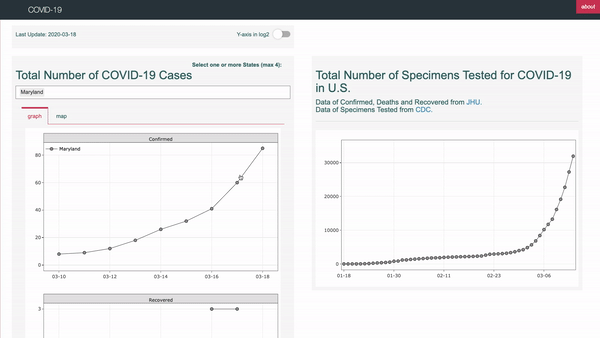

# covid-19

A Shiny App, hosted [here](https://rden.shinyapps.io/covid-19/), **to
monitor the trends of COVID-19 confirmed and deaths cases in
each U.S. state** and the **number of specimens tested for COVID-19 in
all U.S**. Data are updated daily.

Other dashboards (notably the
[JHU](https://coronavirus.jhu.edu/map.html)), allow the visualization of
more global data, but provide less details regarding the daily changes
in each U.S. state.

### data

**Data** of confirmed, deaths and recovered cases was obtained from [JHU
repository](www.github.com/CSSEGISandData/COVID-19), whereas the data of
specimens tested was scraped from the [CDC
website](https://www.cdc.gov/coronavirus/2019-ncov/cases-updates/testing-in-us.html).
